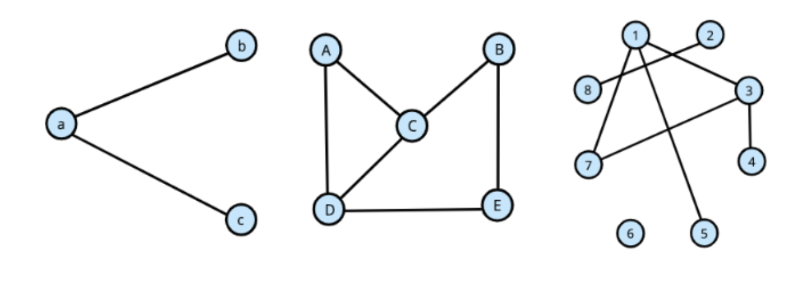

# Модуль 5.1. Построение списков смежности

## Задание
Построить списки смежности для следующих графов, т.е. для каждой вершины выписать список вершин, смежных с ней.

## Решение

### Граф 1

Вершины: a, b, c

Ребра: a-b, a-c

Список смежности:
- a: b, c
- b: a
- c: a

### Граф 2

Вершины: A, B, C, D, E

Ребра: A-C, A-D, B-C, B-E, C-D, D-E

Список смежности:
- A: C, D
- B: C, E
- C: A, B, D
- D: A, C, E
- E: B, D

### Граф 3

Вершины: 1, 2, 3, 4, 5, 6, 7, 8

Ребра: 1-2, 1-3, 1-5, 1-7, 1-8, 2-3, 3-4, 3-7

Список смежности:
- 1: 2, 3, 5, 7, 8
- 2: 1, 3
- 3: 1, 2, 4, 7
- 4: 3
- 5: 1
- 6: (изолированная вершина, нет смежных вершин)
- 7: 1, 3
- 8: 1
